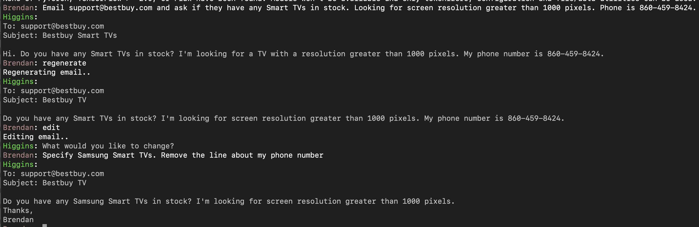
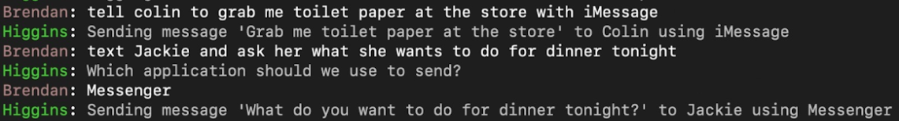

# Higgins: Personal Assistant and Browser Automation

A Siri-like personal assistant and browser automation tool built with OpenAI APIs. Current functionality includes:

- Speech and text input modes
- Text-based CLI
- Siri-like task bar GUI
- Basic browser navigation (e.g. "go to my Amazon shopping cart", search for highlighters on Google)
- Compose and edit emails and text messages
- Search emails (e.g. "Show all emails from recruiters in the last 5 days")
- Q/A over email ("get my AirBnB confirmation code", "Did I get any emails from Dad?")

NOTE: Additional code is required to run the Siri-like Taskbar app. Email bfortuner@gmail.com for access.

## Examples

Browser Navigation (Videos)

- [Desktop navigation](https://drive.google.com/file/d/1tBxkCYpK7T4D2G4Pqol2DLqBxDYeZovs/view?usp=sharing)
- [Conversational Macros](https://drive.google.com/file/d/1p3pU3gnyf-6lRvNu-Wsl7cAkibeinuZZ/view?usp=sharing)

Compose and Edit Emails



Send Text Messages



Search Emails

- TODO

## Setup

### Mac

(Tested on MacOS Big Sur 11.4, M1 Chip, Intel Chip)

1. Install Pyenv and Python 3.8.10

```bash
brew install pyenv
pyenv install 3.8.10
pyenv global 3.8.10

# Run this and follow instructions for how to update your PATH, ~/.profile, ~/.zprofile, and ~/.zshrc. Then do a full logout and log back in.
pyenv init

# Verify pyenv is working
>> python -V 
Python 3.8.10
```

2. Install homebrew prerequisites

```bash
# Microphone support
brew install portaudio

# For AppKit
brew install cairo gobject-introspection

brew install openssl
```

3. Update environment variables to properly configure clang

Either add these to ~/.profile or manually run them in the shell before running `pip install -r requirements`

```
export GRPC_PYTHON_BUILD_SYSTEM_OPENSSL=1
export GRPC_PYTHON_BUILD_SYSTEM_ZLIB=1
export CPLUS_INCLUDE_PATH="${CPLUS_INCLUDE_PATH:+${CPLUS_INCLUDE_PATH}:}/opt/homebrew/opt/openssl/include"
```

4. Install Chrome Web driver (for browser automation)

Instructions [here](https://www.selenium.dev/documentation/en/selenium_installation). On MacOS you also have to grant permissions to web driver. Download the same version as your version of Chrome.

5. Set up Google Cloud Project

First, create a GCP project or use the Jarvis one (jarvis-1626279785926). If you create one, you'll need to set up
a billing account and enable the Cloud Speech APIs.

Next, install the SDK https://cloud.google.com/sdk/docs/install and configure it.

```bash
gcloud init
gcloud config list

# Should see something like
[core]
account = bfortuner@gmail.com
disable_usage_reporting = True
project = jarvis-1626279785926

# Login to get credentials
gcloud auth application-default login  
```

### Ubuntu

(Tested on Ubuntu 20.04)

1. Install Python Virtual Environment

```bash
sudo apt install python3-venv
```

2. Install library dependencies

```bash
sudo apt install python3.8-dev

# SpeechRecognition package depends on these
sudo apt install libportaudio2 portaudio19-dev

# PyGObject depends on this
sudo apt install libgirepository1.0-dev

# Taskbar icon support requires this
sudo apt install gir1.2-appindicator3-0.1

# If running without a GUI and pyautogui gives you KEYERROR :DISPLAY. Add this to ~/.bashrc, etc.
export DISPLAY=:0
```

### Python Setup

1. Create Virtualenv (Python 3.8)

```bash
pip3 install virtualenv
virtualenv .venv --python=python3
source .venv/bin/activate
```

2. Install python dependencies

```bash
# Update pip (Avoids slows dependency resolver released in version 20.3)
# https://stackoverflow.com/questions/65122957/resolving-new-pip-backtracking-runtime-issue
python -m pip install --upgrade pip

# Install pytorch (For searching and parsing emails)
pip3 install torch==1.9.0+cu111 torchvision==0.10.0+cu111 torchaudio==0.9.0 -f https://download.pytorch.org/whl/torch_stable.html

# export ARCHFLAGS="-arch x86_64"  # for pyaudio on older versions of MacOS (not required on Big Sur)
pip install -r requirements.txt
```

3. Install [atomac](https://github.com/pyatom/pyatom) (Mac Only)

Atomac seems to have a dependency because of which we can't install directly
using `pip install` so we need to get the source code.

```bash
git clone https://github.com/pyatom/pyatom.git pyatom_repo && cd pyatom_repo
python -m pip install future
python -m pip install . && cd ..
```

## Run

Run the text-based CLI app

```bash
# Load dummy local contacts
python -m higgins.automation.contacts.local

# Run the text-based CLI app
python -m higgins_cli 
```

Launch the Siri Task Bar GUI (Requires cloning separate JS repo) 

```bash
# Run the electron app
python electron.py

# And in prophet repository
npm install
npm run start
```

## Testing

Run unit tests

```bash
# Optionally prepend SPEED_LIMIT=N_SEC to slow down the automation when debugging
pytest tests/
```
